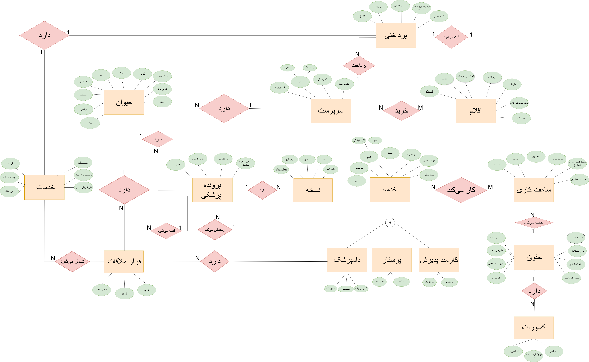

# 🏥 Vet Clinic Database 📊  

  

## 📌 **About This Project**  
This project is a **fully structured MySQL database** designed for a veterinary clinic. It **stores and manages pet information, owners, visits, and treatments** efficiently. The database schema follows **best normalization practices** to ensure data integrity.  

👨‍💻 **Developed by:**  
- [Arman Esmaeili](https://github.com/ArmanEsmaeili)  
- [Maryam Khodayari](https://github.com/maryamkhodayari)  

---

## ⚡ **Features**  
✔️ **Efficient Database Design** - Uses normalization principles  
✔️ **ER Diagram** - Clear structure of relationships  
✔️ **Sample Queries** - Pre-written SQL queries for testing  
✔️ **Easy Installation** - Just run the SQL script provided in Section 4
✔️ **Well-Documented** - Includes explanations for all tables  

---

## 🛠️ **Installation**  
To use this database on your system, follow these steps:  

### 1️⃣ **Clone the Repository**  
```sh
git clone https://github.com/ArmanEsmaeili/vetclinic-database.git
cd vetclinic-database

